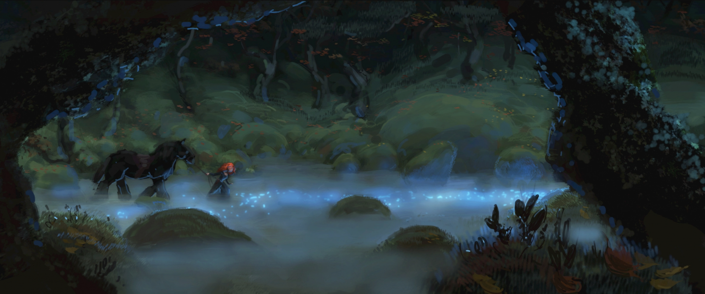

# Myths 
*August 2020*

*View the finished project [here](https://lauragarrison87.github.io/myths/)*

Part of creative coding project series that will hopefully keep up on a monthly basis. The inspiration for this prompt was from my recent discovery of an amazing storytelling podcast, [Mythos](https://www.mythospodcast.com/), and the film Brave.

The [will o' the wisp](https://www.ancient-origins.net/myths-legends-europe/spirit-science-casting-light-enchanting-will-o-wisp-009566) is common in Scottish folklore, often to lead one to treasure or doom in the swamps or bogs of the wilds. 

"It is said—though by whom is a bit of a mystery—that on certain days for certain travelers in certain parts of the world, little lights dance on the horizon, whispering tempting invitations… pledging the answers to lifelong questions, the realization of dreams, a key to secret treasures—a change of fate." 

*Code adapted from [p5-tangled](https://github.com/haleyparkdesign/p5-tangled) with [p5.js](https://p5js.org/).*

